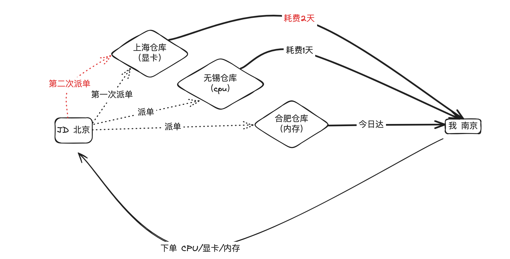
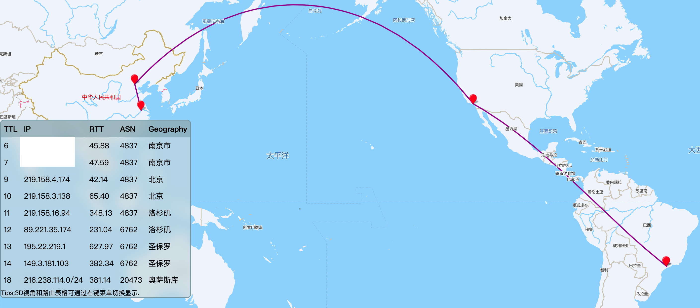
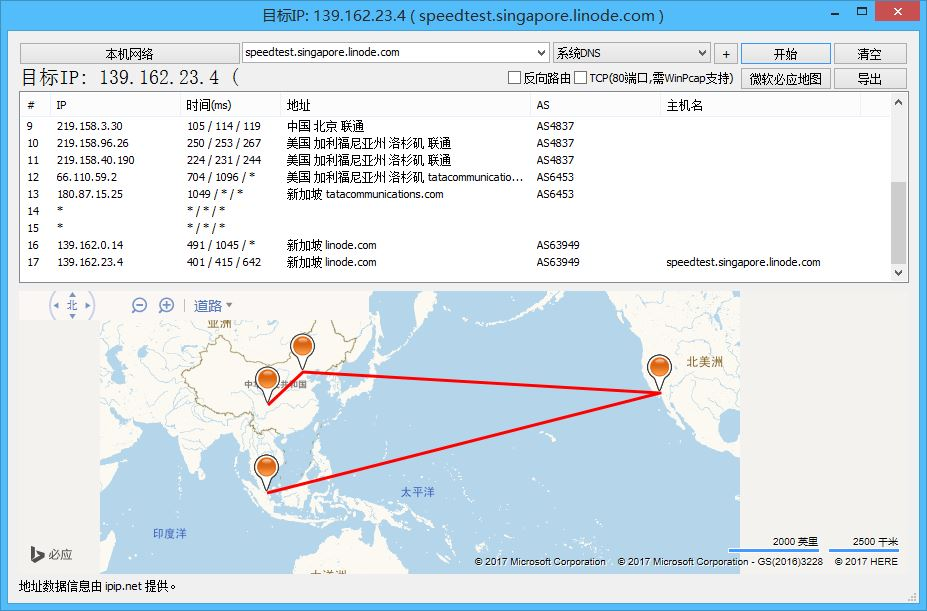
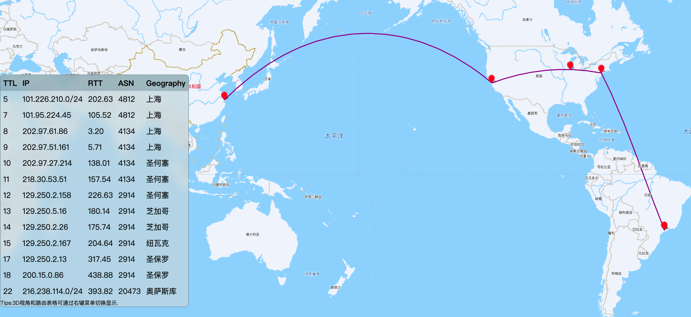
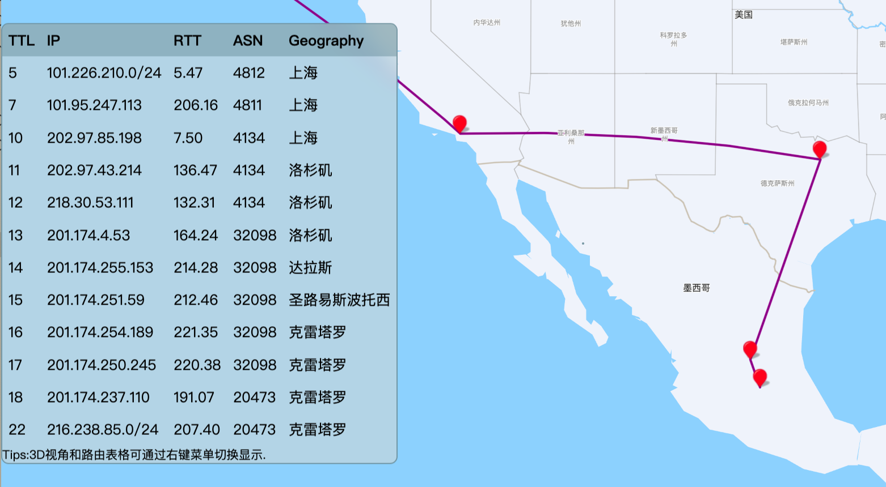
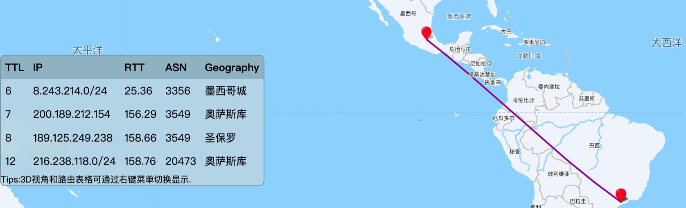

> Ehco-Relay 上线一段时间后，看到了一些反馈，才忽然意识到，原来有很多人都不明白流量转发是什么，也不知道为什么需要使用流量转发服务。所以我决定写一篇新手友好的流量转发入门文档，希望能帮助到更多的人。

## 从 TCP 说起

我们都知道，网络上相当一部分数量的数据传输是通过 TCP 协议来实现的。而大部分的应用层协议，比如 HTTP、HTTPS、SSH、RDP 等等都是基于 TCP 协议的，如果 TCP 的链路足够通畅，那么跑在更上层的应用也就会跑的更快更稳定。

链路是指两个设备之间的通信路径，比如你的浏览器和到你正在阅读的文档服务器之间的通信路径，就是一个链路。链路的通畅程度，可以理解为链路上的数据传输速度和稳定性，这条链路越通畅，你访问本文档的速度就越快。

数据是如何在链路上传输的呢，用最简单的话: TCP 在传输数据时，会将数据分割成一个个小的数据包，然后以**小包**的方式将数据传输到目的地，目的地收到这些包后，再将这些小包组装成完整的数据。

举个例子：每次数据的传输，就像是我在 jd.com 组装一台高性能 PC 来玩 AI 大模型，为了追求性价比（贫穷），我选择分别购买配件后自己攒机。下单之后着等着突然发现 **4090** 的物流信息卡着不动了，老板查了之后一脸震惊的表示: 快递员看中了我的 4090，并提卡跑路了，没办法他只能**重新**给我发一件

当所有的配件都收到并组装完成，本次购物（数据传输）就完成了，画个图看看这个过程：



-   **重派单送显卡**的行为是 TCP 传输过程中的一个常见操作：**丢包重传**
-   **每一个**配件到达所**耗费**的时间，是另一个重要的指标：**延迟**

## 检查链路

评价链路好坏的关键的指标是**包延迟**和**丢包率**，越低的延迟和越少的丢包重传，就意味着链路越通畅。

知道了是什么在阻碍我学习先进的 AI 技术（打游戏），就可以开始思考如何更快的攒机（优化链路了）

其实也非常简单并且符合直觉，**充钱就能变的更强。**

-   **减少延迟**：从原本的陆运改为空运，从小哥送到驿站改成直接送到家门口。
-   **减少丢包率**：提高快递员的待遇水平，入职就送 4090，减少提卡跑路的可能性。。。

实际上的网络情况，**尤其是国际互联网**远比上 JD 买个电脑复杂的多的多

举一个例子：我有一台 vultr **巴西机房**的服务器，我需要经常 ssh 上该服务器，但不知为什么操作是卡顿严重，几乎无法正常使用

为了检查为什么会出现这种情况，我使用了 `ping`,`nexttrace` 工具来查看链路情况

### 通过 ping 看延迟和丢包

```bash
root@XiaoQiang:~# ping 216.238.xx.xx
64 bytes from 216.238.xx.xx: seq=51 ttl=51 time=348.450 ms
64 bytes from 216.238.xx.xx: seq=52 ttl=51 time=348.625 ms
^C
--- 216.238.xx.xx ping statistics ---
54 packets transmitted, 33 packets received, 38.888% packet loss
```

可以观察到：

-   **延迟太高**: **350ms** 左右的高延迟
-   **经常丢包**: **40%** 的夸张丢包率

### 通过 nexttrace 查看链路和路由



可以明显的看到线路的选择并不是最优，包从我家出来之后，并没有以直线的方式直接送往巴西

而是先去了北京，再由该点的机房跨越太平洋到达美国，最后再由美国的机房跨越大西洋到达巴西

实际上，数据包在网络上传输时，**想以一条笔直的线路直接送往目的地是非常困难的**

因为网络的复杂性，数据包可能会经过很多的**路由器、交换机**等设备，这些设备会根据自己的算法来选择下一跳的路由，这就导致了数据包可能会走一条非常不合理的路线。

网上还有各种奇葩绕路的路由，比如：



## 优化链路

那么有没有办法让数据包走一条更快的路线呢？

答案是肯定的,充钱就可以变得更强，那我直接拉一条**物理专线**，从我家路由器开始挖地埋线，海底光缆直接到巴西机房，这样就能保证数据包以最短的路径到达目的地。

但问题是我又不是王思聪，没那么多钱，怎么办呢？可以通过相对较为便宜的**流量转发服务**来达到类似的效果。

> 他真干过类似的事情：[你家宽带一个月多少钱？王思聪：不贵 20W 【王思聪网络和服务器改造第二期 拉专线】](https://www.youtube.com/watch?v=qBArigGkVWc)

### 第一次转发

以当前 Ehco-Relay 提供的**免费**上海 SSH 节点为列，上海到巴西的链路是这样的：



没有**绕路**去北京，而是直接跨越太平洋到达美国，再由美国的机房跨越大西洋到达巴西

由于是商业宽带，包的优先级也会比家庭宽带的优先级高，所以也几乎不丢包

```bash
64 bytes from 216.238.xx.xx: icmp_seq=42 ttl=251 time=394 ms
64 bytes from 216.238.xx.xx: icmp_seq=43 ttl=251 time=367 ms
^C
--- 216.238.xx.xx ping statistics ---
44 packets transmitted, 40 received, 9.091% packet loss, time 43178ms
```

### 第二次转发

不过仔细看看美国到巴西的链路，还是有一些绕路的情况

这也好解决，可以在墨西哥再次做一次转发，这样就能更快的到达巴西

-   上海-美国-墨西哥



-   墨西哥-巴西



这样 ssh 数据包会先通过上海的机房后在发送往巴西，由于丢包率的减少，操作起来也就更加流畅了。

## 更多的使用方式

本文只介绍了 Ehco-Relay 的最基本的直接转模式，实际上还支持通过定制流量的入口和出口的转发实现，更多请参考：[隧道转发](rule/tunnel.md)

本文只介绍了 SSH 这种使用场景，但由于大多数应用层协议都是基于 TCP 的，实际上可以使用 Ehco-Relay 来转发任何基于 TCP 的流量，包括但不限于：

-   转发 tailscale/zerotier/frp 等内网穿透服务的中继节点的流量，从而优化服务质量
-   转发国内网络的流量，从而优化国内网络的访问速度
-   转发国际网络的流量，从而优化国际网络的访问速度
-   更多请参考：[使用场景](usage/relay.md)

## 推荐工具

最后附上一些推荐的工具，帮助你更好的检查链路和优化链路

-   [nexttrace](https://github.com/nxtrace/NTrace-core)
-   [nali](https://github.com/zu1k/nali)
