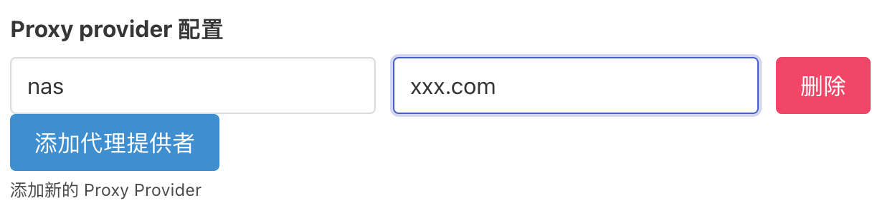
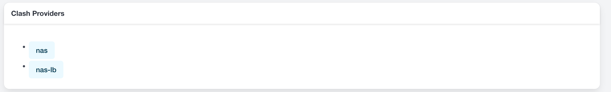
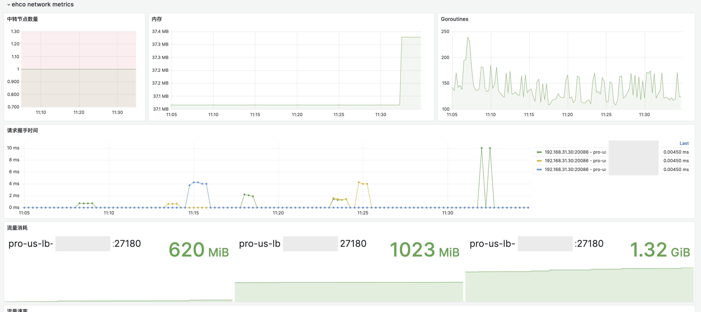

# 重写代理集

## 介绍

ehco 能够作为代理集的前置代理，自动合并具有相同前缀的代理集中的代理。这一功能旨在实现负载均衡和带宽叠加的效果。

目前，ehco 支持以下代理集：

-   Clash Proxy Provider

## 配置步骤

要添加节点并配置 Proxy Provider，您需要在添加节点的配置末尾指定 Proxy Provider 的名称和 URL。



配置参数说明：

-   `name`: 代理集的名称。
-   `url`: 代理集的 URL。

请确保该 URL 返回的代理集采用的是 Clash 格式。以下是一个示例：

```yaml
proxies:
    - name: us-1
      server: s1
      port: 1
    - name: us-2
      server: s2
      port: 2
    - name: jb-1
      server: s3
      port: 3
```

## 重写代理集

在 Ehco 的 Web 页面上，您可以查看到重写后的代理集信息。一个代理集会被重写成两个新的代理集：一个保留原代理集的名称，另一个则是原名称加上 `-lb` 后缀。



### name

点击链接，可以查看代理集的详细信息：

```yaml
proxies:
    - name: us-1
      server: <ip-of-your-node>
      port: 1
    - name: us-2
      server: <ip-of-your-node>
      port: 2
    - name: jb-1
      server: <ip-of-your-node>
      port: 3
```

-   每个代理的 `server` 字段被替换为了节点的 IP 地址。
-   其他字段保持不变。

### name-lb

点击链接，您可以查看到代理集的详细信息：

```yaml
proxies:
    - name: us-lb
      server: <ip-of-your-node>
      port: <new-port>
    - name: jp-lb
      server: <ip-of-your-node>
```

-   具有相同前缀的代理会被合并为一个代理。
-   合并后的代理名称以前缀加上 `-lb` 表示。
-   合并后的代理的 `server` 字段被替换为节点的 IP 地址。
-   合并后的代理的 `port` 字段被替换为一个新的端口，该端口是随机生成的，以避免与其他代理的端口冲突。

## 使用

获取重写后的代理集 URL 后，您可以在 Clash 中使用它：

```yaml
proxy-providers:
    nas:
        type: http
        url: http://192.168.31.30:20086/clash_proxy_provider/?sub_name=nas&grouped=true
        path: ./providers/nas.yaml
```

这样，您就可以在 Clash 中使用代理集了，并且所有流量都会通过 Ehco 节点转发。

如果您配置了[监控功能](../usage/monitor.md)，可以在监控页面查看到代理集的使用情况。


